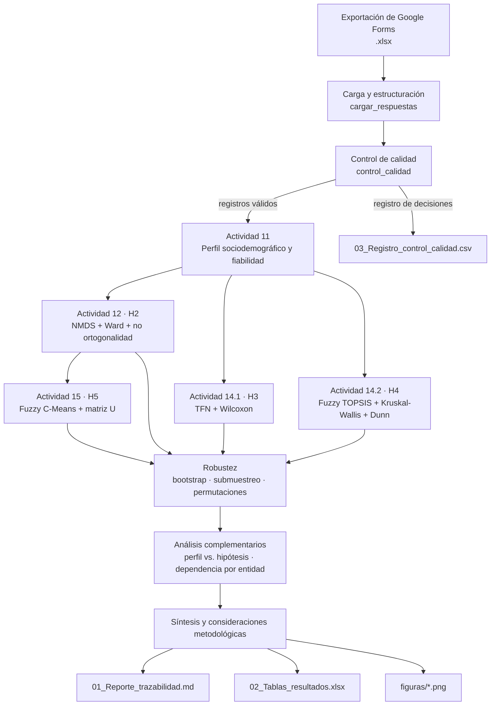

# DUI 2026 · Análisis final con trazabilidad del Modo de Innovación DUI

**Mapeo Conceptual Grupal, lógica difusa y análisis multicriterio para caracterizar el Modo de Innovación DUI (*Doing, Using, Interacting*) en sistemas sectoriales de baja intensidad tecnológica.**

Este repositorio contiene el código de análisis de las Actividades 11, 12, 14 y 15 de la tesis doctoral:

> **Arquitectura Nomológica y Dinámica Difusa del Modo de Innovación DUI: Reconceptualización, Brechas de Aplicación y Fronteras de Pertenencia en Sectores de Baja Intensidad Tecnológica.**
> Laboratorio empírico: sistema sectorial de innovación agroalimentario colombiano.
> Doctorado · Universidad de Sucre (Colombia).

---

## Contenido

1. [Propósito](#1-propósito)
2. [Preguntas e hipótesis que se contrastan](#2-preguntas-e-hipótesis-que-se-contrastan)
3. [Principios metodológicos](#3-principios-metodológicos)
4. [Arquitectura del código](#4-arquitectura-del-código)
5. [Metodología por fase](#5-metodología-por-fase)
6. [Criterios de decisión declarados](#6-criterios-de-decisión-declarados)
7. [Cuantificación de la incertidumbre](#7-cuantificación-de-la-incertidumbre)
8. [Categorías de interpretación](#8-categorías-de-interpretación)
9. [Instalación](#9-instalación)
10. [Uso](#10-uso)
11. [Configuración](#11-configuración)
12. [Productos generados](#12-productos-generados)
13. [Trazabilidad y reproducibilidad](#13-trazabilidad-y-reproducibilidad)
14. [Datos y privacidad](#14-datos-y-privacidad)
15. [Limitaciones conocidas](#15-limitaciones-conocidas)
16. [Referencias](#16-referencias)
17. [Cita, autoría y licencia](#17-cita-autoría-y-licencia)

---

## 1. Propósito

El script `DUI_Analisis_Final_2026.py` procesa la exportación de Google Forms en la que actores del sistema sectorial valoraron **89 enunciados** del modo de innovación DUI (31 Hacer, 29 Usar, 29 Interactuar) con **dos criterios** en escala Likert de 1 a 5:

- **Importancia Teórica:** grado en que el enunciado representa el modo de innovación DUI.
- **Relevancia Aplicativa:** grado en que el actor observa la práctica aplicada en su campo de desempeño.

A partir de esas valoraciones, el script ejecuta en una sola corrida el control de calidad, la caracterización sociodemográfica, el contraste de las hipótesis H2 a H5, los análisis de robustez y la generación de un reporte trazable con tablas y figuras.

## 2. Preguntas e hipótesis que se contrastan

**Pregunta específica P3.** ¿Cuáles son los grados de pertenencia simultánea (fronteras difusas), la priorización multicriterio y las brechas entre la importancia teórica y la aplicabilidad práctica de los subcomponentes del modo de innovación DUI dentro del sistema sectorial evaluado?

| Hipótesis | Enunciado | Actividad | Técnica principal |
|---|---|---|---|
| **H2** | Las prácticas DUI se estructuran en dimensiones latentes no ortogonales que trascienden la separación clásica Hacer, Usar e Interactuar. | 12 | NMDS + clusterización de Ward |
| **H3** | Existe una brecha significativa entre la Importancia Teórica y la Relevancia Aplicativa. | 14.1 | Números difusos triangulares + Wilcoxon |
| **H4** | La priorización de los subcomponentes difiere según el tipo de actor. | 14.2 | Fuzzy TOPSIS + Kruskal-Wallis + Dunn-Bonferroni |
| **H5** | Los subcomponentes presentan pertenencia simultánea a varios clústeres (fronteras difusas). | 15 | Fuzzy C-Means + matriz de pertenencia U |

La hipótesis H1 (validez de contenido de las definiciones del constructo) corresponde a una fase anterior de la tesis y no se procesa en este script.

## 3. Principios metodológicos

1. **Solo datos reales.** El script no genera, duplica, imputa ni pondera registros. Cada observación analizada corresponde a una respuesta de un participante.
2. **Criterios declarados de antemano.** Las reglas de decisión de cada hipótesis y del control de calidad están fijadas en la sección de configuración y se aplican sin reinterpretación según el resultado.
3. **Incertidumbre explícita.** Cada indicador se reporta con su rango: intervalo *bootstrap* o rango de estabilidad por submuestreo.
4. **Interpretación estandarizada.** Cada valor se clasifica según categorías publicadas en la literatura (sección 8).
5. **Trazabilidad completa.** Cada ejecución registra la huella SHA-256 del archivo analizado, la fecha, las versiones del software, la semilla aleatoria y la decisión sobre cada registro.
6. **Independencia de librerías inestables.** NMDS, Fuzzy C-Means, Fuzzy TOPSIS, la prueba de Dunn y la corrección FDR están implementados sobre NumPy y SciPy, para evitar diferencias entre versiones de paquetes especializados.

## 4. Arquitectura del código

### 4.1 Flujo general



### 4.2 Organización del script

| Sección | Contenido | Funciones principales |
|---|---|---|
| **0. Configuración** | Rutas, semilla, parámetros de remuestreo, criterios de calidad, criterios de decisión, mapeos (macro-grupo, dimensión teórica, nivel de estudios, sector, región) y funciones de categorización | `dimension_teorica`, `macro_grupo`, `nivel_agrupado`, `sector_inferido`, `cat_*` |
| **1. Utilidades estadísticas** | Algoritmos implementados desde cero y funciones de apoyo | `nmds`, `fcm`, `indices_fcm`, `fuzzy_topsis`, `a_tfn`, `dist_vertice`, `similitud_items`, `cronbach_alpha`, `kruskal_perm`, `dunn_bonferroni`, `fdr_bh`, `epsilon2_kw` |
| **2. Carga y control de calidad** | Lectura de la exportación, detección automática de columnas, normalización de ciudades y entidades, reglas de exclusión | `cargar_respuestas`, `control_calidad` |
| **3. Reporte y trazabilidad** | Presentación en consola o en entorno interactivo (`IPython.display`), huella SHA-256, escritura segura de archivos | `Reporte`, `sha256`, `ruta_escribible`, `guardar`, `exportar` |
| **4. Actividad 11** | Perfil sociodemográfico en porcentajes, cruces por macro-grupo, concentración institucional | `sociodemografico` |
| **5. Actividades 12, 14 y 15** | Contraste de H2 a H5, remuestreo, figuras | `hipotesis`, `bf10_grupos`, `poder_kw` |
| **6. Análisis complementarios** | Relación del perfil con las hipótesis; dependencia entre participantes de una misma entidad | `socio_vs_hipotesis`, `icc1` |
| **7. Ejecución** | Orquestación, síntesis, consideraciones metodológicas y exportación | `main` |

### 4.3 Estructuras de datos

- **`meta`** (`DataFrame`): una fila por registro, con identificador, marca temporal, tipo de actor, macro-grupo, nivel de estudios, entidad, ciudad, región y sector.
- **`REP` y `APL`** (`ndarray`, participantes × 89): calificaciones de Importancia Teórica y Relevancia Aplicativa.
- **`items`** (`DataFrame`): número, código (E01–E89), texto, dimensión teórica y posición en el formulario de cada enunciado.
- **`qc`** (`DataFrame`): indicadores de calidad, índice Qᵢ, decisión y motivo para cada registro.
- **`T`** (`dict` de `DataFrame`): todas las tablas de resultados, que se exportan a Excel.

## 5. Metodología por fase

### Fase 1 · Carga y estructuración

- Detección automática de los pares de columnas de cada enunciado, en la forma "Enunciado N" seguida de su columna de Relevancia Aplicativa.
- Detección de las columnas de tipo de actor, nivel de estudios, entidad, ciudad y sector. Se excluyen de la búsqueda las columnas de enunciados, para evitar coincidencias falsas.
- Normalización de ciudades (tildes, mayúsculas, variantes) y asignación a región: Caribe, Andina y Orinoquía/Amazonía/Pacífico.
- Unificación de variantes de escritura de una misma entidad.
- Clasificación de los diez tipos de actor en tres macro-grupos: **Productivos**, **Academia/Conocimiento** e **Intermediación/Regulación**.

### Fase 2 · Control de calidad

Cada registro se evalúa con reglas fijadas antes del análisis:

| Regla | Umbral | Fundamento |
|---|---|---|
| Completitud | 100 % de los 178 ítems respondidos | Integridad del registro |
| Variabilidad | Desviación estándar global ≥ 0,5 | Detección de respuesta descuidada (Meade y Craig, 2012) |
| Respuesta uniforme (*straightlining*) | Misma calificación en < 90 % de los enunciados de cada criterio | Johnson (2005); Curran (2016) |
| Duplicado exacto | Vector de respuestas idéntico a otro registro | Supuesto de independencia de las observaciones |
| Duplicado aproximado | Coincidencia < 95 % con cualquier otro registro | Detección de copias con celdas modificadas |
| Marca temporal repetida | Hora de envío idéntica a otro registro | Google Forms registra la hora exacta de cada envío |

Además, se calcula un **índice de calidad Qᵢ ∈ [0, 1]** como promedio de cuatro componentes: completitud, variabilidad, ausencia de respuesta uniforme y ausencia de rachas largas de respuestas idénticas (*longstring*). Los registros con Qᵢ < 0,5 se marcan para revisión manual.

### Fase 3 · Actividad 11: caracterización y fiabilidad

- **Perfil sociodemográfico** en porcentajes: nivel de estudios agrupado (Técnicos, Profesionales, Posgrados) y detallado, tipo de actor, macro-grupo, sector, entidad, región y ciudad.
- **Cruces por macro-grupo** (% por fila) con nivel de estudios y región, para identificar posibles factores de confusión.
- **Concentración institucional:** número de entidades, participación de la entidad más frecuente e índice de Herfindahl-Hirschman normalizado.
- **Fiabilidad:** alfa de Cronbach por criterio, con intervalo *bootstrap* estratificado.

$$\alpha = \frac{k}{k-1}\left(1-\frac{\sum_{i=1}^{k}\sigma_i^2}{\sigma_T^2}\right)$$

### Fase 4 · Actividad 12: mapa de puntos y clusterización (H2)

1. **Similitud entre enunciados.** Cada enunciado se representa por su perfil de calificaciones en ambos criterios. Las calificaciones se estandarizan dentro de cada participante para eliminar su tendencia a calificar alto o bajo. La disimilitud es $\delta_{ij} = 1 - \rho_{ij}$, con $\rho$ la correlación de Spearman.
2. **NMDS de Kruskal** en dos dimensiones, mediante SMACOF con regresión isotónica, una inicialización por MDS clásico y 19 aleatorias.

   $$\text{Stress-1} = \sqrt{\frac{\sum_{i<j}(d_{ij}-\hat{d}_{ij})^2}{\sum_{i<j}d_{ij}^2}}$$

3. **Clusterización jerárquica de Ward** sobre las coordenadas del mapa. El número de clústeres k ∈ {3, …, 8} se elige por el coeficiente de silueta.
4. **Contraste con la tríada teórica** mediante el Índice de Rand Ajustado (ARI), con prueba de permutación de 5.000 iteraciones.
5. **No ortogonalidad:** correlaciones de Spearman entre los puntajes de cada participante en Hacer, Usar e Interactuar, para ambos criterios, con intervalos *bootstrap*.
6. **Estabilidad:** 200 submuestras estratificadas del 80 % sin reemplazo. En cada una se recalcula el mapa y se mide el ARI con la solución original, la congruencia de Procrustes y la frecuencia con que cada par de enunciados comparte clúster.

### Fase 5 · Actividad 14.1: brecha teórico-práctica (H3)

1. **Fuzzificación.** Cada calificación se transforma en un número difuso triangular $\tilde{a}=(l,m,u)$:

   | Likert | 1 | 2 | 3 | 4 | 5 |
   |---|---|---|---|---|---|
   | TFN | (1,1,2) | (1,2,3) | (2,3,4) | (3,4,5) | (4,5,5) |

2. **Agregación** por media de vértices y **defuzzificación** por centroide: $(l+m+u)/3$.
3. **Distancia de vértice** entre Importancia y Relevancia de cada enunciado:

   $$d(\tilde{a},\tilde{b}) = \sqrt{\tfrac{1}{3}\left[(l_a-l_b)^2+(m_a-m_b)^2+(u_a-u_b)^2\right]}$$

4. **Prueba de Wilcoxon** para datos pareados sobre los 89 enunciados, global y por dimensión, con tamaño del efecto $r = Z/\sqrt{N}$ e intervalo *bootstrap* de la brecha mediana.
5. **Mapa go-zone:** cuatro cuadrantes delimitados por las medias de ambos criterios.

### Fase 6 · Actividad 14.2: priorización por tipo de actor (H4)

1. **Fuzzy TOPSIS** (Chen, 2000), con los dos criterios de beneficio ponderados por igual, normalización por el máximo de la escala y soluciones ideales positiva (1, 1, 1) y negativa (0, 0, 0):

   $$CC_i = \frac{d_i^{-}}{d_i^{+}+d_i^{-}}, \qquad 0 \le CC_i \le 1$$

   Se calcula el CCi global, por macro-grupo y por participante.
2. **Kruskal-Wallis** sobre el CCi medio de cada participante (global y por dimensión), con p asintótico, p por permutación (10.000 iteraciones) y tamaño del efecto:

   $$\varepsilon^2 = \frac{H(N+1)}{N^2-1}$$

3. **Pruebas de Dunn** con corrección por empates y ajuste de Bonferroni.
4. **Kruskal-Wallis por enunciado** con control de la tasa de falsos descubrimientos (Benjamini-Hochberg).
5. **Factor de Bayes BF10** por aproximación BIC (Wagenmakers, 2007) sobre los rangos, para cuantificar la evidencia a favor de la igualdad o de la diferencia entre grupos.
6. **Poder estadístico** con el efecto observado, mediante la distribución F no central, y tamaño muestral necesario para un poder del 80 %.
7. **Modelo lineal mixto exploratorio** (si `statsmodels` está instalado): CCi ~ grupo × dimensión, con intercepto y pendientes aleatorias por participante. Se contrasta por razón de verosimilitud. Este análisis no interviene en la decisión.

### Fase 7 · Actividad 15: fronteras difusas (H5)

1. **Fuzzy C-Means** (Bezdek, 1981) sobre las coordenadas estandarizadas del mapa, con el mismo número de clústeres de Ward, fuzzificador m = 2 y 20 inicializaciones:

   $$u_{ij} = \left[\sum_{k=1}^{c}\left(\frac{\lVert x_i-v_j\rVert}{\lVert x_i-v_k\rVert}\right)^{\frac{2}{m-1}}\right]^{-1}, \qquad \sum_{j} u_{ij}=1$$

2. **Índices de partición:** FPC, FPC normalizado, entropía de partición normalizada e índice de Xie-Beni.

   $$FPC_{norm} = \frac{FPC - 1/c}{1 - 1/c}$$

3. **Pertenencia simultánea:** enunciados con segundo grado de pertenencia $u_{i(2)} \ge 0{,}25$, con su frecuencia en las submuestras.
4. **Concordancia** entre la partición difusa (pertenencia máxima) y la de Ward.

### Fase 8 · Análisis complementarios

- **Perfil frente a hipótesis:** comparación de la brecha individual (H3) y del CCi individual (H4) según nivel de estudios, región y sector (si está disponible), con Kruskal-Wallis o Mann-Whitney y control FDR. Solo se comparan categorías con al menos 3 participantes.
- **Dependencia por entidad:** coeficiente de correlación intraclase ICC(1) del CCi, efecto de diseño y tamaño efectivo de la muestra:

  $$\text{Efecto de diseño} = 1 + (\bar{m}-1)\,ICC, \qquad n_{ef} = n/\text{Efecto de diseño}$$

### Fase 9 · Síntesis y reporte

- Tabla de síntesis con la evidencia clave y la decisión de cada hipótesis.
- Consideraciones metodológicas detectadas automáticamente: grupos por debajo del mínimo, concentración territorial superior al 40 % y sector inferido.
- Estado del análisis: **DEFINITIVO** si los tres macro-grupos alcanzan el mínimo declarado, **PRELIMINAR** en caso contrario.

## 6. Criterios de decisión declarados

| Hipótesis | Se apoya si… |
|---|---|
| **H2** | ≥ 50 % de los pares de dimensiones están correlacionados (p < 0,05) **y** ARI entre clústeres y tríada < 0,50 |
| **H3** | Wilcoxon p < 0,05 **y** el intervalo *bootstrap* de la brecha mediana no incluye el cero |
| **H4** | Kruskal-Wallis global p < 0,05 **o** alguna dimensión p < 0,0167 (Bonferroni para tres dimensiones) |
| **H5** | FPC normalizado entre 0,20 y 0,80 **y** ≥ 10 % de enunciados con pertenencia simultánea |

El Stress-1, el R², los factores de Bayes, el poder, el modelo mixto y los análisis complementarios se reportan como información de calidad y contexto. **No modifican las decisiones.**

## 7. Cuantificación de la incertidumbre

| Procedimiento | Aplicación | Justificación |
|---|---|---|
| **Bootstrap estratificado** (2.000 réplicas, con reemplazo, dentro de cada macro-grupo; intervalo percentil al 95 %) | Alfa de Cronbach, correlaciones de H2, brecha y r de H3, ε² de H4 | Adecuado para estadísticos a nivel de participante |
| **Submuestreo estratificado sin reemplazo** (200 réplicas al 80 %) | Stress, ARI, estabilidad y Procrustes de H2; FPC y multi-pertenencia de H5 | El bootstrap con reemplazo duplica participantes, distorsiona la matriz de similitud y sesga hacia abajo el ARI. Los rangos obtenidos describen la estabilidad, no son intervalos de confianza |
| **Pruebas de permutación** (5.000 para el ARI; 10.000 para Kruskal-Wallis) | p-valores de H2 y H4 | No dependen de supuestos distribucionales, lo que es relevante con grupos pequeños |

## 8. Categorías de interpretación

| Indicador | Categorías | Referencia |
|---|---|---|
| Alfa de Cronbach | ≥ 0,90 excelente · ≥ 0,80 buena · ≥ 0,70 aceptable | — |
| Stress-1 | < 0,10 excelente · < 0,20 bueno · 0,205–0,365 aceptable en Mapeo Conceptual Grupal · > 0,365 insuficiente | Kruskal (1964); Rosas y Kane (2012) |
| ARI | ≥ 0,90 excelente · ≥ 0,80 buena · ≥ 0,65 moderada · < 0,65 pobre | Steinley (2004) |
| Estabilidad (ARI réplica–original) | ≥ 0,75 alta · 0,50–0,75 moderada · < 0,50 baja | — |
| Correlación y r | 0,10 débil · 0,30 moderada · 0,50 fuerte | Cohen (1988) |
| ε² de Kruskal-Wallis | 0,01 pequeño · 0,08 moderado · 0,26 grande | Tomczak y Tomczak (2014) |
| BF10 | 1–3 anecdótica · 3–10 moderada · 10–30 fuerte · > 30 muy fuerte | Lee y Wagenmakers (2013) |
| FPC normalizado | < 0,20 muy difusa · 0,20–0,80 intermedia · > 0,80 rígida | — |
| Poder | ≥ 80 % adecuado · 50–80 % moderado · < 50 % bajo | Cohen (1988) |

## 9. Instalación

Requiere **Python 3.10 o superior**.

```bash
git clone https://github.com/CCIBANEZB/<nombre-del-repositorio>.git
cd <nombre-del-repositorio>
pip install -r requirements.txt
```

Dependencias (`requirements.txt`):

```text
pandas>=2.0
numpy>=1.24
scipy>=1.11
scikit-learn>=1.3
matplotlib>=3.7
openpyxl>=3.1
statsmodels>=0.14      # opcional: modelo mixto de H4
ipython>=8.0           # opcional: presentación enriquecida en Jupyter/VS Code
```

## 10. Uso

1. Descargue las respuestas desde Google Forms como archivo `.xlsx`, **sin editarlas**.
2. Guarde el archivo en el Escritorio con el nombre `DUI Innovation Mode - Part 2 (respuestas).xlsx`. El script también reconoce nombres que coincidan con `DUI Innovation Mode*respuestas*.xlsx` o `*GCM*DUI*.xlsx`, y busca en el Escritorio, en la carpeta de OneDrive y en el directorio actual.
3. Ejecute el script de alguna de estas formas:

| Entorno | Comando | Presentación |
|---|---|---|
| Terminal | `python DUI_Analisis_Final_2026.py` | Texto plano |
| VS Code | Clic derecho → *Run Current File in Interactive Window* (requiere `ipykernel`) | Tablas con formato, decisiones resaltadas y figuras en línea |
| Jupyter | `%run DUI_Analisis_Final_2026.py` | Tablas con formato, decisiones resaltadas y figuras en línea |

Una ejecución completa tarda entre 2 y 10 minutos, según el equipo.

## 11. Configuración

Todos los parámetros están en la **sección 0** del script:

| Parámetro | Valor | Descripción |
|---|---|---|
| `ARCHIVO_RESPUESTAS` | `"DUI Innovation Mode - Part 2 (respuestas).xlsx"` | Archivo de entrada |
| `CARPETA_SALIDA` | `"Resultados finales 2026"` | Carpeta de resultados |
| `SEMILLA` | `42` | Semilla de todos los procesos aleatorios |
| `N_BOOTSTRAP` | `2000` | Réplicas *bootstrap* |
| `N_SUBMUESTREO` / `FRACCION_SUBMUESTREO` | `200` / `0.80` | Submuestreo para H2 y H5 |
| `N_PERMUTACIONES` | `10000` | Permutaciones para Kruskal-Wallis |
| `MIN_COMPLETITUD` · `MIN_DE_GLOBAL` · `MAX_PROP_MODAL` · `UMBRAL_CASI_DUPLICADO` | `1.00` · `0.50` · `0.90` · `0.95` | Reglas de control de calidad |
| `MINIMO_POR_GRUPO` / `META_POR_GRUPO` | `20` / `28` | Diseño muestral por macro-grupo |
| `ALFA` | `0.05` | Nivel de significancia |
| `UMBRAL_ARI_NO_COINCIDE` · `PROP_PARES_NO_ORTOGONALES` | `0.50` · `0.50` | Criterios de H2 |
| `FPC_NORM_INTERMEDIA` · `UMBRAL_SEGUNDA_PERTENENCIA` · `MIN_PROP_MULTIPERTENENCIA` | `(0.20, 0.80)` · `0.25` · `0.10` | Criterios de H5 |
| `K_RANGO` · `FCM_M` | `range(3, 9)` · `2.0` | Clusterización |
| `PESOS_TOPSIS` · `TFN_LIKERT` | `0.5 / 0.5` · escala triangular | Fuzzy TOPSIS y fuzzificación |
| `ENUNCIADOS_DEFINITIVOS` | `None` | Subconjunto de enunciados (`None` = todos) |

> **Importante:** los criterios de decisión forman parte del diseño de la investigación y no deben modificarse después de observar los resultados.

## 12. Productos generados

```text
Resultados finales 2026/
├── 01_Reporte_trazabilidad.md       Reporte completo en Markdown
├── 02_Tablas_resultados.xlsx        Todas las tablas (una hoja por tabla)
├── 03_Registro_control_calidad.csv  Indicadores, decisión y motivo por registro
└── figuras/                         Una imagen por resultado (PNG, 300 ppp)
```

**Figuras:**

| Prefijo | Contenido |
|---|---|
| `S01`–`S10` | Perfil sociodemográfico: nivel de estudios agrupado y detallado, tipo de actor, macro-grupo, sector, entidad, región, ciudad y cruces por macro-grupo |
| `H2_01`–`H2_05` | Mapa de puntos NMDS, mapa de clústeres de Ward, dendrograma, estabilidad por enunciado y matrices de correlación entre dimensiones |
| `H3_01`–`H3_02` | Mapa go-zone y brecha por dimensión |
| `H4_01`–`H4_03` | CCi por macro-grupo (global y por dimensión), top 20 de enunciados y curva de poder |
| `H5_01`–`H5_02` | Matriz de pertenencia U y fronteras difusas sobre el mapa |
| `X_*` | Brecha y CCi según nivel de estudios y región |
| `Z_rangos_incertidumbre` | Valores observados y rangos de incertidumbre de los indicadores principales |

Si un archivo de salida está abierto o bloqueado (por ejemplo, en Excel o en un visor de imágenes), el script lo guarda con la fecha y hora en el nombre y continúa la ejecución.

## 13. Trazabilidad y reproducibilidad

Cada reporte registra:

- Fecha y hora de ejecución.
- Ruta y **huella SHA-256** del archivo analizado. Cualquier modificación del archivo, incluso volver a guardarlo, cambia la huella. Por eso se recomienda conservar el archivo definitivo en modo de solo lectura.
- Versiones de Python, pandas, NumPy, SciPy y scikit-learn, y el sistema operativo.
- Semilla aleatoria, número de réplicas y criterios de calidad.
- La decisión sobre cada registro, con su motivo y, en los duplicados, el registro de origen.

Con el mismo archivo, la misma semilla y las mismas versiones de software, el script produce resultados idénticos.

## 14. Datos y privacidad

**Este repositorio no incluye datos de participantes.** La base de respuestas contiene información de personas y organizaciones (tipo de actor, entidad, ciudad, nivel de estudios) protegida por la Ley 1581 de 2012 de protección de datos personales de Colombia y por el consentimiento informado otorgado por los participantes.

- No publique la exportación de Google Forms ni el archivo `03_Registro_control_calidad.csv`.
- Si comparte datos para replicación, elimine las columnas de entidad y ciudad y verifique que el consentimiento lo permite.
- Para solicitar acceso a los datos con fines de verificación académica, contacte al autor.

## 15. Limitaciones conocidas

- **Mapa bidimensional.** El Stress-1 y el R² del NMDS en dos dimensiones pueden indicar una representación simplificada; se reportan como indicadores de calidad.
- **Sesgo del ARI por submuestreo.** Con el 80 % de la muestra, el ARI tiende a subestimarse; el rango describe estabilidad, no confianza.
- **Factor de Bayes BIC.** La aproximación usa un prior de información unitaria, conservador con muestras pequeñas.
- **Sector.** Si el formulario no incluye una pregunta de sector económico, el sector se infiere del tipo de actor y se indica en el reporte.
- **Clasificación teórica.** La asignación de enunciados a dimensiones (`dimension_teorica`) sigue la estructura del banco final: E01–E31 Hacer, E32–E60 Usar, E61–E89 Interactuar. Debe ajustarse si se usa otro banco.
- **Tamaño de los grupos.** La potencia de H4 depende del número de participantes por macro-grupo; el script informa el poder alcanzado y el tamaño necesario.

## 16. Referencias

- Bezdek, J. C. (1981). *Pattern recognition with fuzzy objective function algorithms*. Plenum Press.
- Chen, C. T. (2000). Extensions of the TOPSIS for group decision-making under fuzzy environment. *Fuzzy Sets and Systems, 114*(1), 1–9.
- Cohen, J. (1988). *Statistical power analysis for the behavioral sciences* (2.ª ed.). Erlbaum.
- Curran, P. G. (2016). Methods for the detection of carelessly invalid responses in survey data. *Journal of Experimental Social Psychology, 66*, 4–19.
- DeSimone, J. A., Harms, P. D., y DeSimone, A. J. (2015). Best practice recommendations for data screening. *Journal of Organizational Behavior, 36*(2), 171–181.
- Jensen, M. B., Johnson, B., Lorenz, E., y Lundvall, B.-Å. (2007). Forms of knowledge and modes of innovation. *Research Policy, 36*(5), 680–693.
- Johnson, J. A. (2005). Ascertaining the validity of individual protocols from Web-based personality inventories. *Journal of Research in Personality, 39*(1), 103–129.
- Kane, M., y Trochim, W. M. K. (2007). *Concept mapping for planning and evaluation*. Sage.
- Kruskal, J. B. (1964). Multidimensional scaling by optimizing goodness of fit to a nonmetric hypothesis. *Psychometrika, 29*(1), 1–27.
- Lee, M. D., y Wagenmakers, E.-J. (2013). *Bayesian cognitive modeling: A practical course*. Cambridge University Press.
- Meade, A. W., y Craig, S. B. (2012). Identifying careless responses in survey data. *Psychological Methods, 17*(3), 437–455.
- Rosas, S. R., y Kane, M. (2012). Quality and rigor of the concept mapping methodology: A pooled study analysis. *Evaluation and Program Planning, 35*(2), 236–245.
- Steinley, D. (2004). Properties of the Hubert-Arabie adjusted Rand index. *Psychological Methods, 9*(3), 386–396.
- Tomczak, M., y Tomczak, E. (2014). The need to report effect size estimates revisited. *Trends in Sport Sciences, 21*(1), 19–25.
- Wagenmakers, E.-J. (2007). A practical solution to the pervasive problems of p values. *Psychonomic Bulletin & Review, 14*(5), 779–804.

## 17. Cita, autoría y licencia

**Autor:** Cristhian Camilo Ibáñez · Doctorando, Universidad de Sucre (Colombia)
**Director de tesis:** Prof. Fernando Hernández

Si utiliza este código, cite:

```text
Ibáñez, C. C. (2026). DUI 2026: Análisis final con trazabilidad del Modo de Innovación DUI
[Software]. GitHub. https://github.com/CCIBANEZB/<nombre-del-repositorio>
```

**Licencia:** MIT. Consulte el archivo `LICENSE`.
